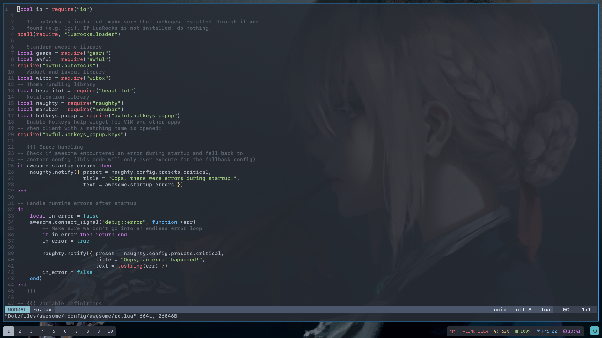
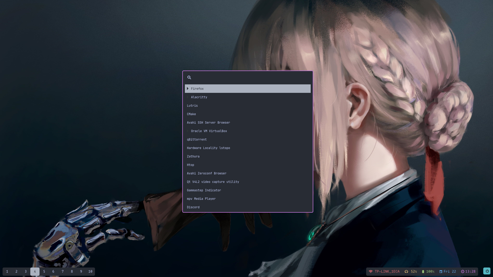
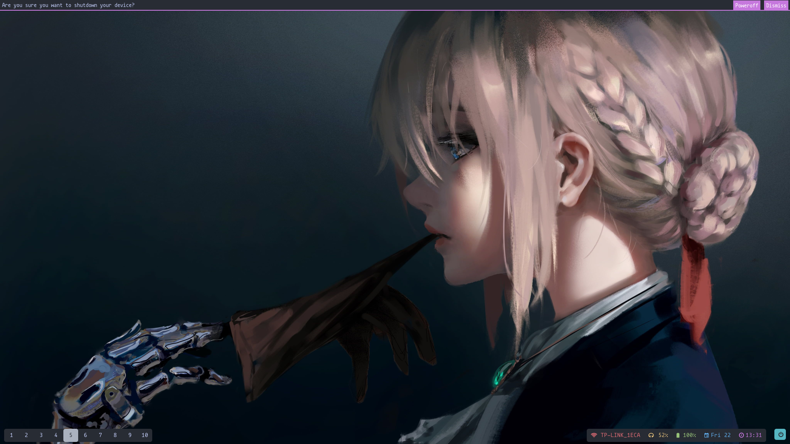

<p align="center">
    
    <h2 align="center"></h2>
</p>

<p align="center">
    <a href="https://github.com/Binaryify/OneDark-Pro">
        
    </a>
</p>


my dotefiles with install script that installs all my preferred programs. it is not yet ready for public use.

## Installation

Use git to clone the repo.

```bash
git clone https://github.com/project-HOSSAM/dotfiles.git ~/Dotefiles
```

## Usage

```shell
cd ~/Dotefiles
chmod +x install.sh
./install.sh
```

## Screenshots

#### Desktop


#### vim


#### wofi


#### zathura


#### swaymsg


#### wallpaper

